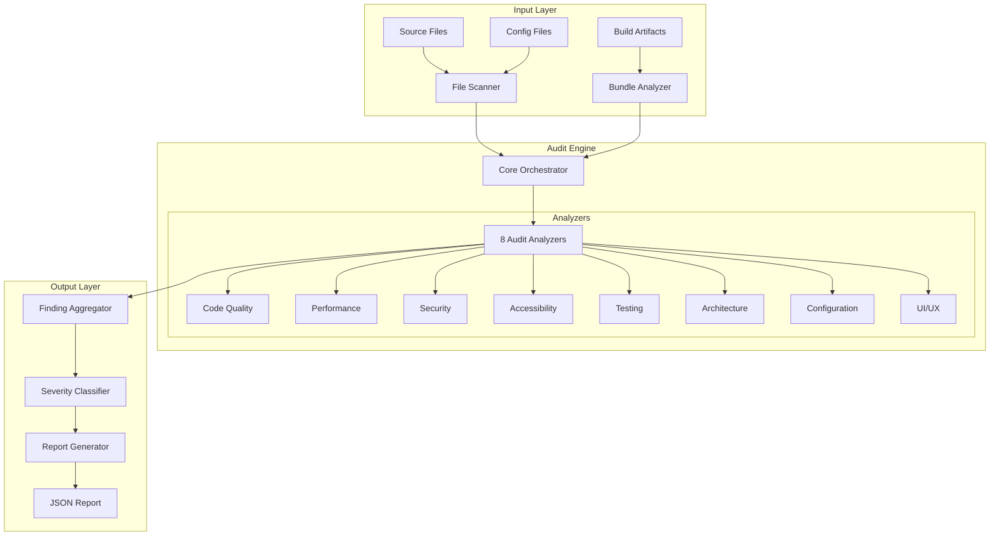
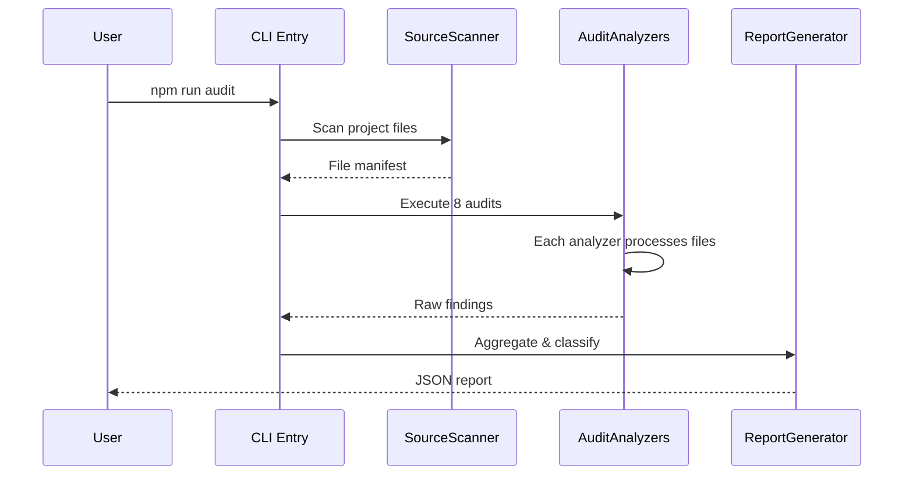

# Project Audit System Design

## Overview

The Project Audit System is a comprehensive static analysis and validation framework designed to evaluate the fast-reading-trainer application across multiple quality dimensions. The system performs automated code analysis across eight audit categories: Code Quality, Performance, Security, Accessibility, Testing, Architecture, Configuration, and UI/UX.

The audit engine operates as a CLI tool that scans the project codebase, runs validation tools, and produces a structured JSON report with findings, severity levels, and actionable recommendations.

**Design Goals:**
- Exhaustive detection of code issues across all audit categories
- Reproducible and consistent results
- Actionable recommendations with code examples
- Support for both automated tooling and manual verification methods

## Architecture

### High-Level System Architecture



### Data Flow



### Directory Structure

```
lib/audit/
├── index.ts              # Main entry point, CLI export
├── core/
│   ├── orchestrator.ts   # Coordinates all audits
│   ├── scanner.ts        # File system scanning
│   └── reporter.ts       # Report generation
├── analyzers/
│   ├── codeQuality.ts    # ESLint, TypeScript, patterns
│   ├── performance.ts    # Bundle, React, memory
│   ├── security.ts       # XSS, auth, secrets
│   ├── accessibility.ts  # WCAG, a11y patterns
│   ├── testing.ts        # Coverage, test quality
│   ├── architecture.ts   # Structure, deps
│   ├── configuration.ts  # Config file validation
│   └── uiUX.ts           # Responsive, visual states
├── models/
│   ├── finding.ts        # Finding data model
│   ├── report.ts         # Report data model
│   └── severity.ts       # Severity enum
├── utils/
│   ├── parsers.ts        # Code parsing utilities
│   ├── rules.ts          # Audit rule definitions
│   └── tools.ts          # External tool wrappers
└── types/
    └── index.ts          # TypeScript interfaces
```

## Components and Interfaces

### Core Components

#### AuditOrchestrator

The central coordinator that manages execution of all audit analyzers.

```typescript
interface AuditOrchestrator {
  // Execute all audits and return combined findings
  runAll(): Promise<AuditResult[]>;
  
  // Execute specific audit category
  runCategory(category: AuditCategory): Promise<AuditResult[]>;
  
  // Get audit configuration
  getConfig(): AuditConfig;
}
```

**Responsibilities:**
- Initialize all analyzers with configuration
- Execute analyzers in parallel where possible
- Collect and aggregate findings
- Handle errors gracefully

#### SourceScanner

Scans project directories and builds a manifest of files to analyze.

```typescript
interface SourceScanner {
  // Scan directory for files matching patterns
  scan(patterns: string[], exclude: string[]): Promise<FileManifest>;
  
  // Get file content by path
  readFile(path: string): Promise<string>;
  
  // Get specific file types
  getTypeScriptFiles(): string[];
  getConfigFiles(): string[];
  getTestFiles(): string[];
}
```

#### FindingAggregator

Collects findings from all analyzers and applies severity classification.

```typescript
interface FindingAggregator {
  // Add finding from an analyzer
  addFinding(finding: RawFinding): void;
  
  // Classify all findings by severity
  classify(): ClassifiedFindings;
  
  // Remove false positives
  markAsFalsePositive(id: string, rationale: string): void;
}
```

#### ReportGenerator

Produces the final JSON report in the required format.

```typescript
interface ReportGenerator {
  // Generate final report
  generate(findings: ClassifiedFindings, metadata: AuditMetadata): AuditReport;
  
  // Format as JSON
  toJSON(report: AuditReport): string;
  
  // Write to file
  writeToFile(path: string): Promise<void>;
}
```

### Analyzer Interfaces

Each audit category implements a consistent interface:

```typescript
interface AuditAnalyzer {
  // Unique identifier
  readonly category: AuditCategory;
  
  // Analyze files and return findings
  analyze(context: AnalysisContext): Promise<AuditResult[]>;
  
  // Get tool configuration
  getConfig(): AnalyzerConfig;
}
```

**Analyzer Implementations:**

| Analyzer | Category | Key Responsibilities |
|----------|----------|---------------------|
| CodeQualityAnalyzer | code-quality | ESLint integration, TypeScript strict, duplicate detection, naming validation |
| PerformanceAnalyzer | performance | Bundle size, React optimization, memory leak detection, localStorage analysis |
| SecurityAnalyzer | security | Input validation, XSS detection, Firebase rules, secret scanning |
| AccessibilityAnalyzer | accessibility | Keyboard accessibility, ARIA labels, focus management, color contrast |
| TestingAnalyzer | testing | Coverage analysis, test quality, integration/E2E detection |
| ArchitectureAnalyzer | architecture | Directory structure, circular deps, dependency versions |
| ConfigurationAnalyzer | configuration | TypeScript, ESLint, Next.js config validation |
| UIUXAnalyzer | ui-ux | Responsive design, visual states, loading states |

## Data Models

### Finding Model

```typescript
// Severity levels
type Severity = 'critical' | 'high' | 'medium' | 'low' | 'informational';

// Audit categories
type AuditCategory = 
  | 'security' 
  | 'performance' 
  | 'code-quality' 
  | 'accessibility' 
  | 'testing' 
  | 'architecture' 
  | 'configuration' 
  | 'ui-ux';

// Raw finding from analyzer
interface RawFinding {
  id: string;
  category: AuditCategory;
  severity: Severity;
  file: string;
  line?: number;
  column?: number;
  description: string;
  recommendation: string;
  codeExample?: string;
  tool?: string;
  rule?: string;
}

// Complete finding with metadata
interface Finding extends RawFinding {
  falsePositive: boolean;
  falsePositiveRationale?: string;
  verified: boolean;
  createdAt: string;
}
```

### Report Model

```typescript
// Summary statistics
interface AuditSummary {
  totalFindings: number;
  bySeverity: {
    critical: number;
    high: number;
    medium: number;
    low: number;
    informational: number;
  };
  byCategory: Record<AuditCategory, number>;
  testCoverage?: string;
  bundleSize?: string;
}

// Complete audit report
interface AuditReport {
  version: string;
  timestamp: string;
  projectName: string;
  projectPath: string;
  summary: AuditSummary;
  findings: Finding[];
  metadata: {
    nodeVersion: string;
    npmVersion: string;
    auditVersion: string;
    executionTime: number;
  };
}
```

### Configuration Models

```typescript
// Audit configuration
interface AuditConfig {
  categories: AuditCategory[];
  excludePatterns: string[];
  includePatterns: string[];
  thresholds: {
    maxAnyTypes: number;
    maxDuplicateLines: number;
    minCoverage: number;
    maxBundleSize: number;
  };
  tools: {
    eslint: boolean;
    typescript: boolean;
    bundleAnalyzer: boolean;
  };
}

// Analysis context passed to analyzers
interface AnalysisContext {
  projectRoot: string;
  fileManifest: FileManifest;
  config: AuditConfig;
  toolResults: ToolResults;
}

// File manifest
interface FileManifest {
  sourceFiles: string[];
  configFiles: string[];
  testFiles: string[];
  totalFiles: number;
  lastModified: Date;
}

// External tool results cache
interface ToolResults {
  eslint?: ESLintResult[];
  typescript?: TypeScriptResult[];
  bundleAnalysis?: BundleResult;
  coverage?: CoverageResult;
}
```

## Correctness Properties

*A property is a characteristic or behavior that should hold true across all valid executions of a system—essentially, a formal statement about what the system should do. Properties serve as the bridge between human-readable specifications and machine-verifiable correctness guarantees.*

### Property 1: Exhaustive Finding Detection

*For any* valid TypeScript source file in the project, the Code Quality audit SHALL detect and report all occurrences of the `any` type usage, and SHALL NOT miss any detectable instance.

**Validates: Requirements 1.1**

### Property 2: Duplicate Code Detection

*For any* set of source files containing 5 or more consecutive identical lines, the audit SHALL identify all such duplicate blocks and report them with their file locations.

**Validates: Requirements 1.2**

### Property 3: Async Error Handling Coverage

*For any* async function in the source code that returns a value (non-void), the audit SHALL verify it is wrapped in a try-catch block or uses equivalent error handling, and SHALL NOT report false positives for properly handled async functions.

**Validates: Requirements 1.3**

### Property 4: File Naming Compliance

*For any* file in components/, hooks/, lib/, or types/ directory, the audit SHALL verify the filename matches the expected naming convention (PascalCase for components, camelCase for utilities), and SHALL NOT flag correctly named files as violations.

**Validates: Requirements 1.4**

### Property 5: React Optimization Detection

*For any* React component file that receives primitive props, the audit SHALL detect if React.memo is missing, and SHALL detect missing useCallback/useMemo for functions/values in dependency arrays.

**Validates: Requirements 2.2**

### Property 6: Memory Leak Prevention Detection

*For any* useEffect or hook that registers event listeners or intervals, the audit SHALL verify corresponding cleanup (removeEventListener, clearInterval, clearTimeout) exists, and SHALL NOT false-positive on properly cleaned up resources.

**Validates: Requirements 2.4, 2.5**

### Property 7: Input Validation Detection

*For any* TextInput component using Zod validation, the audit SHALL detect the schema and verify it includes the required constraints (max length), and SHALL FAIL if validation is missing.

**Validates: Requirements 3.1**

### Property 8: XSS Vulnerability Detection

*For any* component that renders user content, the audit SHALL detect dangerous patterns (dangerouslySetInnerHTML) and SHALL NOT false-positive on safe rendering methods.

**Validates: Requirements 3.2**

### Property 9: Secret Detection

*For any* source file (excluding .env files), the audit SHALL detect hardcoded secrets matching the patterns defined in the requirements, and SHALL NOT flag commented-out code or test fixtures as violations.

**Validates: Requirements 3.5**

### Property 10: Report JSON Serialization Round-Trip

*For any* valid AuditReport object, serializing to JSON and deserializing SHALL produce an equivalent report object with all fields preserved.

**Validates: Requirements 9.1, 9.9**

### Property 11: Severity Classification Consistency

*For any* two findings with identical characteristics (category, file, line, issue type), the audit SHALL classify them with the same severity level.

**Validates: Requirements 9.3**

### Property 12: Critical Finding Detection

*For any* Critical or High severity issue as defined in the acceptance criteria, the audit SHALL include it in the final report and SHALL NOT filter out any such findings.

**Validates: Requirements 9.2**

## Error Handling

### Error Categories

| Category | Description | Handling |
|----------|-------------|----------|
| FileSystemError | Cannot read/write files | Log error, skip file, continue |
| ToolExecutionError | External tool fails | Cache partial results, report failure |
| ParseError | Cannot parse source file | Skip file, note in findings |
| ConfigurationError | Invalid audit config | Abort with clear message |
| TimeoutError | Tool execution timeout | Cancel and report partial results |

### Error Recovery Strategy

```typescript
interface ErrorHandler {
  // Handle file system errors
  handleFileError(path: string, error: Error): void;
  
  // Handle tool execution failures
  handleToolError(tool: string, error: Error): ToolResult | null;
  
  // Collect errors for reporting
  getErrors(): Error[];
  
  // Determine if audit can continue
  canContinue(): boolean;
}
```

**Strategies:**
- **Partial Failures**: If one analyzer fails, continue with others and report the failure in metadata
- **File-level Errors**: Skip individual files that cannot be parsed, log the issue, continue scanning
- **Tool-level Errors**: Cache successful tool results, retry failed tools once, then proceed
- **Fatal Errors**: Configuration errors abort the audit with clear messaging

### Logging

- All errors logged with timestamps and stack traces
- Errors included in report metadata
- Verbose mode for debugging audit execution

## Testing Strategy

### Dual Testing Approach

**Unit Tests:** Specific examples and edge cases
- Test each analyzer in isolation
- Test finding aggregation and classification
- Test report generation
- Test JSON serialization round-trip

**Property Tests:** Universal properties across all inputs
- Test exhaustive detection properties
- Test no-false-negatives properties
- Test consistency of classification
- Test round-trip serialization

### Property-Based Testing Configuration

The audit system itself will be tested using property-based testing to verify:

1. **Exhaustive Detection**: Generate random TypeScript files with various patterns and verify all `any` types are detected
2. **No False Positives**: Generate valid code and verify it's not flagged as problematic
3. **Consistency**: Run same analysis twice and verify identical results
4. **Round-Trip**: Serialize and deserialize reports to verify data integrity

### Test Implementation

```typescript
// Example property test for any-type detection
import { fc, test, assert } from 'vitest';

test('Exhaustive any type detection', () => {
  fc.assert(
    fc.property(
      fc.array(fc.string(), { minLength: 1, maxLength: 50 }),
      (validCodePatterns) => {
        // Generate test file with various patterns
        const code = generateTypeScriptCode(validCodePatterns);
        const findings = runCodeQualityAudit(code);
        
        // Verify all any types are detected
        const anyTypeCount = countAnyTypes(code);
        assert.equal(findings.length, anyTypeCount);
      }
    ),
    { numRuns: 100 }
  );
});
```

### Test File Structure

```
lib/audit/__tests__/
├── orchestrator.test.ts     # Orchestrator unit tests
├── scanners.test.ts         # File scanning tests
├── analyzers/
│   ├── codeQuality.test.ts  # Code quality analyzer tests
│   ├── security.test.ts     # Security analyzer tests
│   ├── performance.test.ts  # Performance analyzer tests
│   └── accessibility.test.ts
├── models/
│   ├── finding.test.ts      # Finding model tests
│   └── report.test.ts       # Report model tests
├── properties/
│   ├── detection.exhaustive.ts  # Exhaustive detection properties
│   ├─��� classification.consistency.ts
│   └── serialization.roundtrip.ts
└── fixtures/
    ├── valid.ts             # Valid code fixtures
    └── problematic.ts       # Problem code fixtures
```

### Testing Tools

- **Framework**: Vitest (already in project)
- **Property Library**: fast-check (for comprehensive property testing)
- **Test Commands**:
  - Unit tests: `npx vitest run lib/audit/__tests__`
  - Property tests: `npx vitest run lib/audit/__tests__/properties --property`
  - Coverage: `npx vitest run --coverage`

### Test Quality Requirements

- Minimum 80% line coverage for audit library
- All properties run with minimum 100 iterations
- Each analyzer has at least 5 unit tests
- Property tests tagged: `/** @property Feature: project-audit */`

## Implementation Notes

### External Tool Integration

| Tool | Purpose | Integration |
|------|---------|-------------|
| ESLint | Code quality rules | Child process execution, parse JSON output |
| TypeScript | Type checking | `tsc --noEmit` with custom tsconfig |
| Bundle Analyzer | Size analysis | `@next/bundle-analyzer` integration |
| npm audit | Security vulnerabilities | Child process, parse JSON output |
| madge | Circular dependencies | Graph analysis |

### Performance Considerations

- Run independent analyzers in parallel using Promise.all
- Cache tool results to avoid repeated execution
- Use streaming for large files
- Set reasonable timeouts for external tools

### Extensibility

- New analyzers can be added by implementing AuditAnalyzer interface
- Custom rules can be registered in rules.ts
- Report format can be customized via ReportGenerator